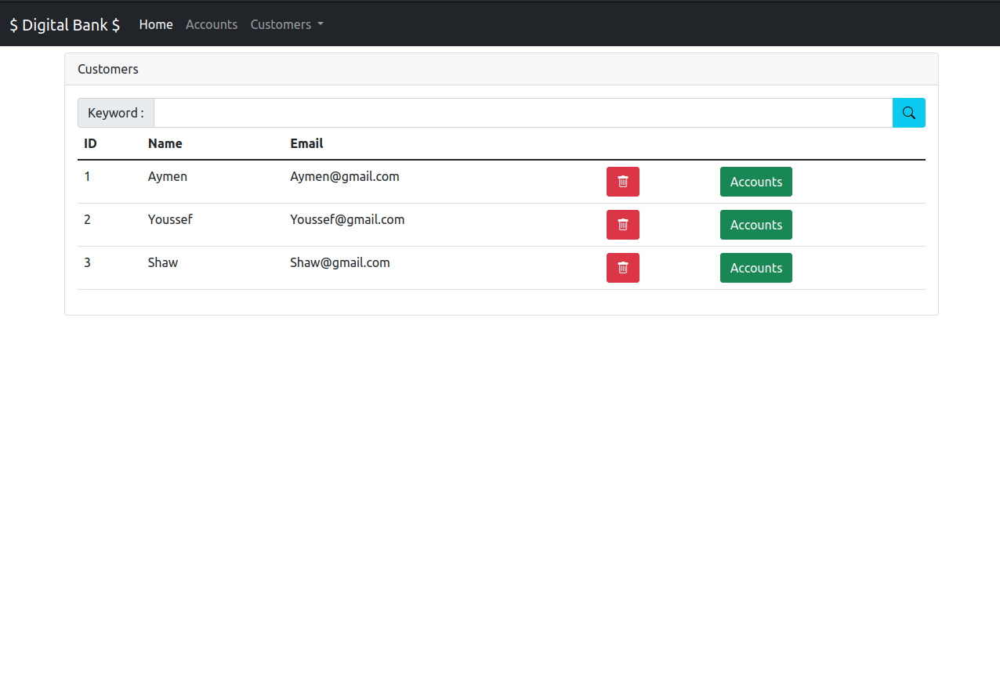
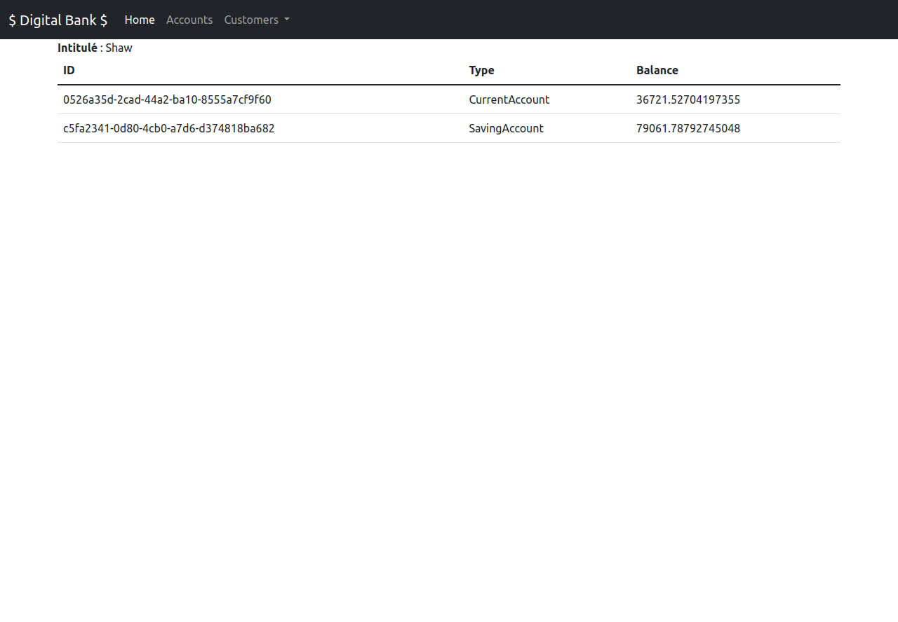
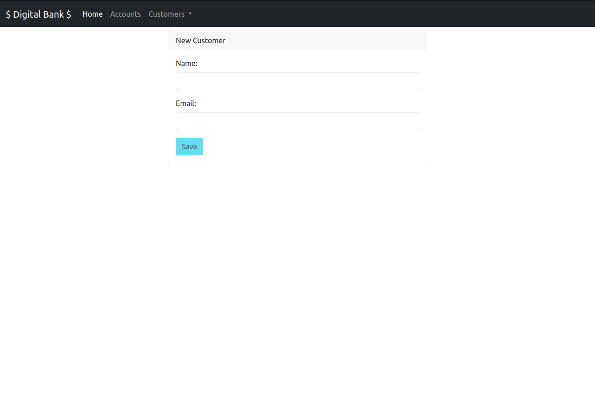
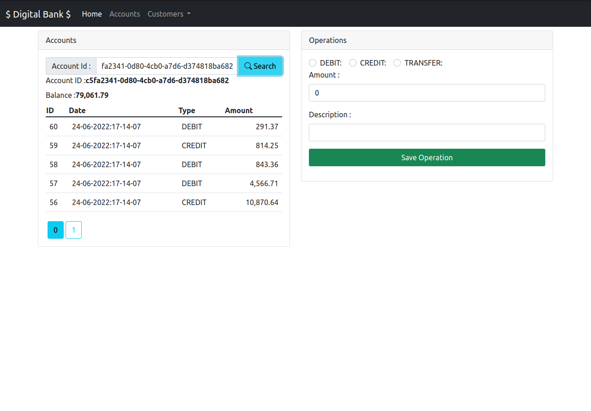

## Introduction
Partie front-end de l'application digitale bank , développer avec angular.
## Captures d'écran
### Liste des client

### Liste des comptes d'un client

### Fomulaire du client

### Page des opérations

